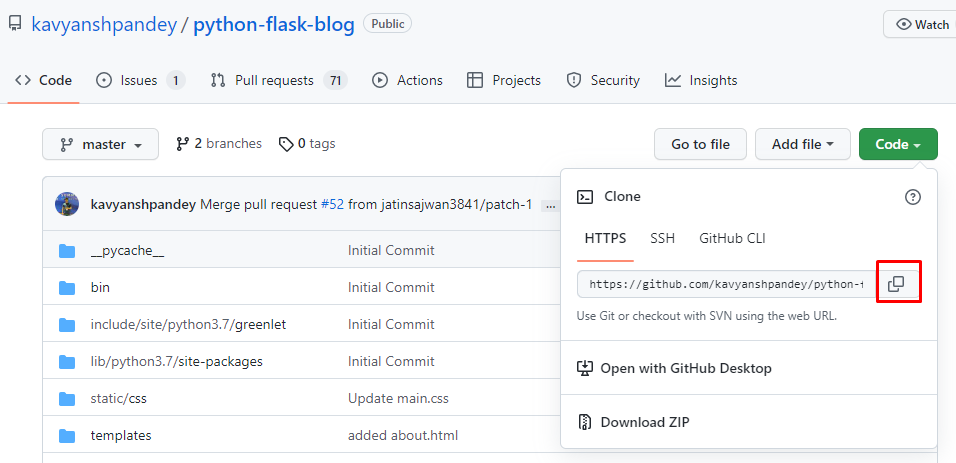

# python-flask-Web-APP

### This is a Web Application made with python-Flask, and SQLLITE3 used as backend.

### Project View

## Use Cases
1. User can add any number of blogpost.
2. User an also edit their blog
3. User can also delete posts by clicking on red button.

 
 

 
 
### How to Run.

 ## **Steps to Run**

### -> Step 1: Clone this repo  

- 
- Click on code and then copy the link
- Use Following command to clone this repo:

  > git clone <https://github.com/kavyanshpandey/python-flask-blog.git>

### ->Step 2: Install dependepcies  

- To install dependepcies use following command:

  > pip install requirements.txt
  
### -> Step 3: Run "app.py"

- To run the app click on run button
- 

 
 
